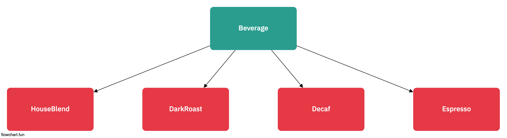
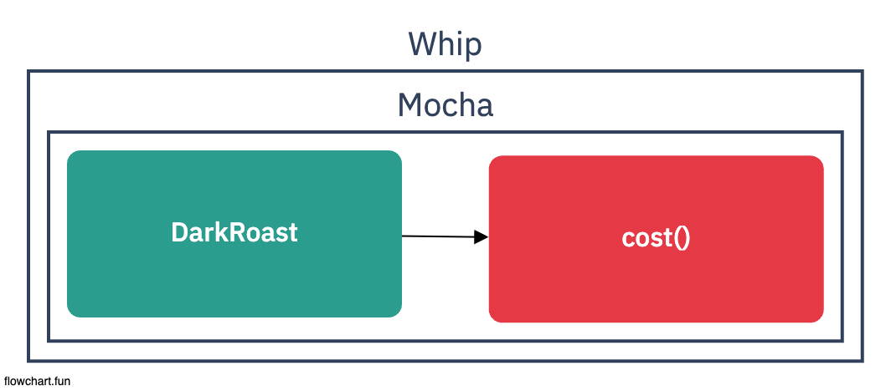
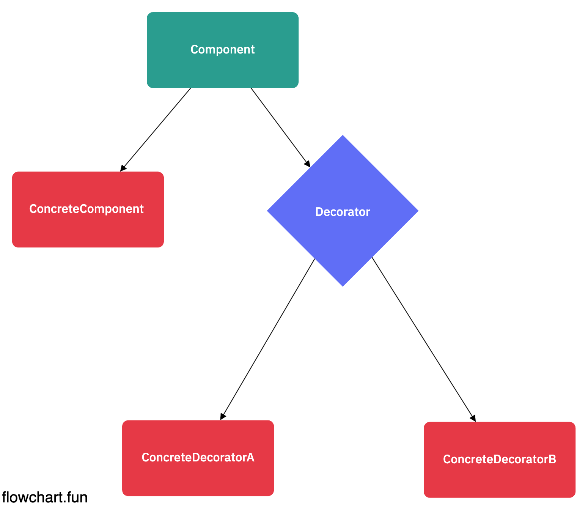
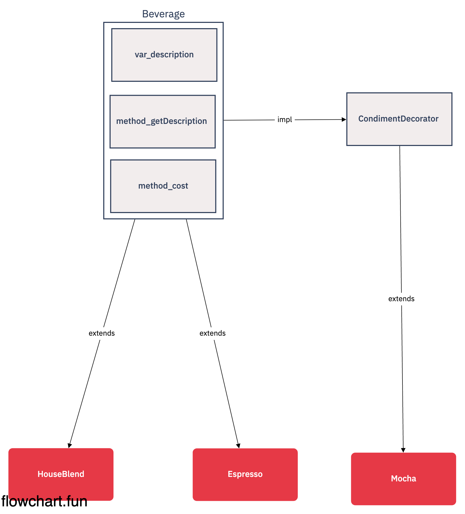
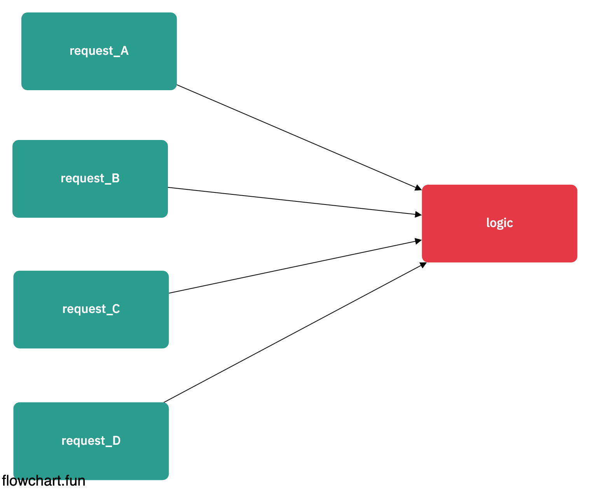
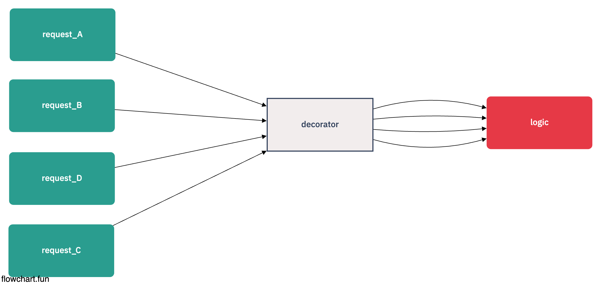

# 데코레이터

## 초대형 커피 전문점, 스타버즈 (p.114)



- 초기 주문시스템 클래스

```ts
class Beverage {
  public description: string

  public getDescription() {}

  public cost() {
    throw new Error('must be implementation')
  }
}

class HouseBlend extends Beverage {
  override cost() {}
}

class DarkRoast extends Beverage {
  override cost() {}
}

class Decaf extends Beverage {
  override cost() {}
}

class Espresso extends Beverage {
  override cost() {}
}
```

- 지금은 HouseBlend ~ Expresso 까지 총 4개의 음료지만?
- 만약 100 ~ N 개의 음료가 생긴다면 각각 Extends 해서 사용해야 되나? (p.115)

## Beverage Class에 다 때려박기 (p.116 ~ p.119)

- 부모 클래스의 굉장히 많은 메서드와 멤버변수가 늘어난다.
- 많은 메서드 === 의존성이 비례된다.
- 의존성이 많아진다는것은 관리가 어려워진다.
- 클래스자체가 무거워지는 것은 좋지 않다.
- SPR (Single Principal Responsibility)

## 상속의 문제점

- 상속 자체는 항상 답이 될수 없음
- 상속 -> 구현이 먼저가 되어야 함
- 부모 클래스가 슈퍼 클래스가 되어야 한다는 것은 좋지 않음

## OCP (Open-Closed Principle) (p.120)

- 클래스는 확장에 열려있어야 하지만, 변경에는 닫혀 있어야 한다

## Decorator 패턴 사용하기 (p.122 ~ p.124)



- Decorator === Wrapper
- 한 객체를 여러개의 데코레이터로 감쌀 수 있다.
- 데코레이터는 결국 자신의 일을 위임이 가능하며, 추가작업을 수행 할 수 있다.
- 객체는 언제든지 감쌀 수 있으며, 실행중에 필요한 데코레이터를 마음대로 적용할 수 있다.
- \*\*객체의 추가요소를 동적으로 더할 수 있는 디자인패턴 \*\*

## Decorator Pattern 적용 (p.125)



- ConcreteComponent

  - 새로운 행동을 동적으로 추가를 함

- Decorator
  - Decorator 안에는 Component 객체가 존재한다
  - 그러한 Component 객체를 사용하여 Update를 한다

## 데코레이터 코드 예제 (p.125 ~ p.132)


[code](./decorator_example.ts)

- 우리가 생성한 Child Class 두개 (HouseBlend, Espresso)
- Decorator Class를 만들어서 우리는 더욱 활용할 수 있는 가짓수가 늘었다.
  - HouseBlend
  - Espress
  - HouseBlend + Mocha
  - Espress + Mocha
  - N + Mocah

## 데코레이터 패턴의 단점 (p.133)

- Decorator로 한번감싸면, 그 감싼 객체가 어떤(Houseblend, Espress) 인지 어떻게 아냐?

      - 물론, 알기힘들다.
      - 알게 할 수는 있죠 => 다만 추천하지는 않는다 => 좀 더러워진다. => 데코레이터 페턴이 항상 정답은 아니다

```ts
abstract class CondimentDecorator extends Beverage {
  protected beverage?: Beverage

  // 자식클래스에서 구현
  public abstract getDescription(): string

  // 자기자신이 누구인지?
  public abstract whoareyou(): string
}
```

- 데코레이터를 빼먹는 실수를 할 수 있지 않나?

  - 빼먹을 수 있지...
  - 현재 데코레이터가 존재하는지 검사하는 로직 => 생성자 단에서 무조건적으로 입력받을 수 있게 (Complie)
  - 모카 -> 두유 -> 휘핑크링을 차례로 추가하게끔 강제하는 로직 (Builder...)

- 문자열 자체를 다르게 표현하게 싶다?
  - 안에있는 메서들 자체를 수정하면 된다.

## Decorator pattern 예제





```ts
import * as functions from 'firebase-functions'

interface CoalvoCallableContenxt extends functions.https.CallableContext {
  ua: any
  isWebBrowserRequest: boolean
}

export type Middleware = (
  data: any,
  context: CoalvoCallableContenxt,
  next: (data: any, context: CoalvoCallableContenxt) => Promise<any>
) => Promise<any>

export const withMiddlewares = (middlewares: Middleware[], handler: any) => (data: any, context: CoalvoCallableContenxt) => {
  const chainMiddlewares = ([firstMiddleware, ...restMiddlewares]: Middleware[]) => {
    if (firstMiddleware) {
      return (data: any, context: CoalvoCallableContenxt): Promise<any> => {
        try {
          return firstMiddleware(data, context, chainMiddlewares(restMiddlewares))
        } catch (e) {
          return Promise.reject(e)
        }
      }
    }
    return handler
  }
  return chainMiddlewares(middlewares)(data, context)
}
```
