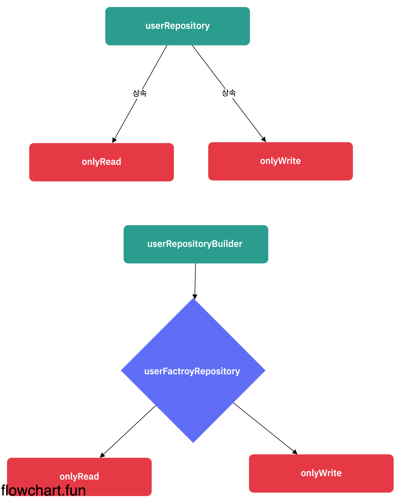
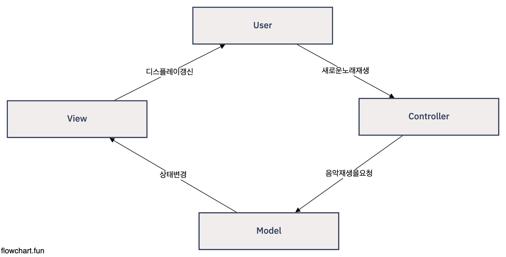
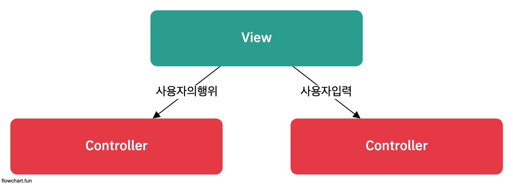
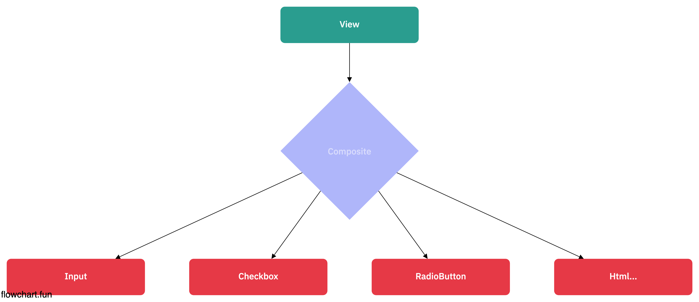
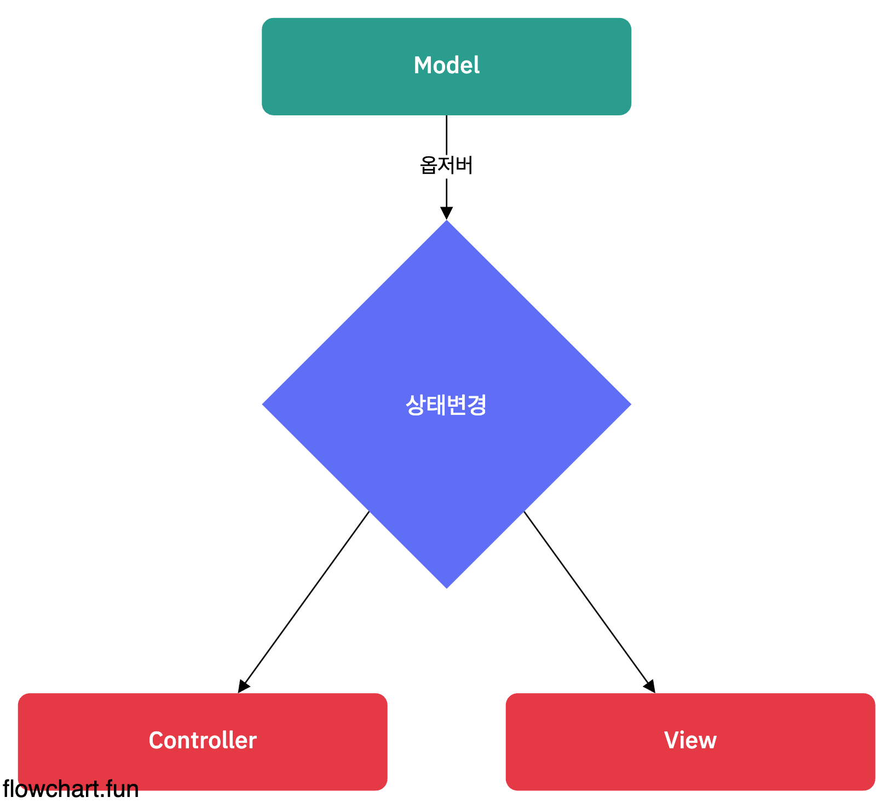

# 복합패턴

- 이제 까지 배워왔던 패턴들을 복합해서 사용해보자.
- 여러 패턴들을 조합하여 더 좋은 패턴으로 발생...

## 이전회사에서 썼었던 복합패턴

- Factory + Builder
- 실제 Repository Class를 Builder + Factory에 의존...

  
  [user-repo-code](./example_1.ts)

## 애 복합패턴을 사용하냐?

- 복합패턴을 사용해어 반복적으로 생길 수 있는 일반적인 문제를 해결하는 용도로 2개 이상의 패턴을 결합해서 사용한다.
- 패턴 -> 어려운 문제를 해결하기 위함
- 어려운 문제가 여러개 존재 -> 패턴 여러개 복합적으로 사용 -> code가 어려워질 염려가 있지만 -> Design Pattern

## 오리 시뮬레이션 게임에 다양한 패턴적용하기 (p.529)

- 간단한 오리 시뮬레이터 코드 (p.529 ~ 530) => 간단한 상속

  [simule-code](./simulator_1.ts)

```sh
    ts-node simulator_1.ts
```

- 거위가 생기고 Adpater를 적용한 코드 (p.530 ~ 533) => Adapter Pattern

```sh
    ts-node simulator_2.ts
```

- 그러면 오리 + 거위 Quack한 갯수를 세고싶다 (p.534 ~ p535) => Proxy Pattern

```sh
    ts-node simulator_3.ts
```

## 이러한 패턴을 정리해보면...

- p.535 ~ p.550
- 복합패턴의 공통점이 있다.
- 객체지향 프로그래밍 Motto -> Class + 인스턴스
- 기능을 추가한다는 건 2 가지 측면
  - 메서드의 추가
  - Class 변형을 해서 기능을 추가한다
- 디자인패턴에서 주요 내세우는 특징 -> 기존 클래스는 건들지 않는다 (OCP?)
- 기능을 추가하되, 기존의 클래스를 건드리지 않는 방향 -> <b>Proxy</b> => 덮어씌운다

```ts
    const quack() {
        console.log("quack")
    }

    const quackWrap() {
        quack()
        console.log("kic kic")
    }

    const quackWrap2() {
        quackWrap()
        console.log("nono")
    }
```

- 결국, 기존의 클래스를 건드리지않고 옳게 올바르게 수정한다고하면 Proxy 형태를 거치게 됩나다.
- 코드가 늘어날수도 있고, 줄어들 수도 있습니다.
- 굉장히 중요한 장점 > Code Standard가 완벽해진다. > 모두가 동일한 생각을 하게됨 (통일) > 어디서 문제가 났는지 확실하게 알수가 있다. (의외로..)

## 바뀐 내용 정리해보기 (p.551 ~ p.552)

1. Quackable 인터페이스 생성
2. 거위가 등장하면서 -> Proxy Pattern이 적용
3. 꽥꽥하는 소리가 몇번 호출 -> Decorator Pattern 적용
4. 객체 생성단에서 문제가 있을까봐 -> Factory Pattern 적용
5. 객체관리를 용이하게 하기 위해선 Composite Pattern 적용
6. Quack을 사용했을때, Event Programming 형태를 도입하기 위해 -> Observable Pattern이 적용

## 라떼는... (인턴 MFC 시절)

- 개발하기전에, 객체 다이어그램을 정의하고 구성함 (UML 다이어그램)
- 객체 다이어그램을 그리고 개발을 시작함
- 죄다 Class 였고, 실제 EntryPoint는 main.start() 형식으로 도입...
- 개발을 하고싶어도 할수가 없었음 (내가 많이 부족함)
- 2년전..

## 복합패턴의 왕 알현하기 (p.554 ~ )

- MVC (Model-View-Controller)

  - SSR (Node)
  - View (pub, ejs)

- MVC의 장점 / 특징 (p.557 ~ p.559)

  

  - 사용자 -> View Interaction이 가능
  - Controller -> Model 상태를 변경하라고 요청 (가능)
  - Controller -> View 상태를 변경하라고 요청 (가능)
  - 상태가 변경(Model) -> View 상태를 알려준다
  - View가 Model 상태를 알려준다.
  - Observble + Strategy ...

- MVC가 사용되는 Design Pattern들... (p.560 ~ )

  - 전략패턴
    

  - 컴포지트 패턴
    

  - 옵저버 패턴
    
