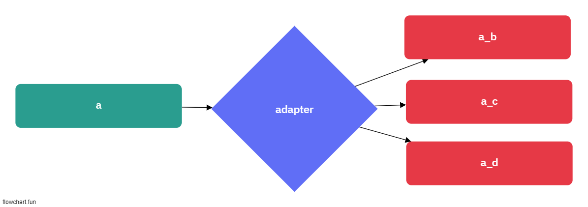

# 어댑터 패턴

## Adapter? (p272 ~ 274)

- 어떠한 인터페이스를 클라이언트에서 요구하는 형태로 적응시키는 역할을 함
- 중개인 역할을 지원함
- A -> B로 갈수 없는 상황에서 Adapter를 사용해서 연결도 가능

## Adapter 예제 (p274 ~ p278)

1. family 인스턴스를 Adapter를 사용하여 다른 결과값 내기

[simple_adapter_code_example](./simple_adapter.ts)

2. 다른 메서드지만 Adapter를 사용해서 해결

[duck_code_example](./duck.ts)

- Conclusion
  - Adapter를 사용해서 A, B 사이의 Proxy 역할을 해준다.
  - Adapter라는 방법을 사용해서 결국, 메서드를 우회?, 재생성? 형태로 구성

## Adpater 패턴의 정의 (p278 ~ p280)

- 특정 클래스 인터페이스를 클라이언트에서 요구하는, 다른 인터페이스로 변환합니다. 인터페이스가 호환되지 않아 같이 쓸수 없었던 클래스를 사용할 수 있게 도와준다.

- 장점

  - A, B 간의 역할을 Adapter 형태로 지원
  - 클라이언트 단에서는 Interface 만으로도 참조가 가능
  - Composition > Extends

- 단점
  - 로직이 복잡해짐 (A, B, C, A_Adpater_From_B, A_Adapter_From_C, B_Adapter_From_C)
  - Adpter가 너무 많아진다면? => 사실 그것도 재앙

## Object Adapter vs Class Adapter (상속과 구성의 차이)

> 객체 어댑터 (Composition)

- p281 사진참조
- 구성 위주
- 위에 사용했었던 방식과 같음
- Adapter를 사용하여 Duck, Turkey를 Mapping

> 클래스 어댑터 (Extends)

- p281 사진참조
- 상속위주
- Class 자체 다중상속 받아서 구성

  [class_adapter_code_example](./class_adapter.ts)

# 퍼사드 패턴 (p290)

- 인터페이스를 단순하게 바꾸기위해, 인터페이스를 변경하는 방법
- 하나이상의 클래스 인터페이스를 깜끔하게 퍼사드로 덮어준다

## 퍼사드 패턴 예제 (p291 ~ )

- 수많은 클래스 존재
- 인터페이스화를 진행하고 싶음
- method 및 동작형태로 나열함
- 동작형태의 대한 중복이 존재하니, 인터페이스로 정리
- 인터페이스를 class로 정의
- 근데 쉽게 하고싶음 => 퍼사드 패턴 => 이거뭐임
- <b>복잡한 서브클래스들의 공통적인 기능을 정의하는 상위수준의 인터페이스를 제공하는 패턴</b>

[facade_code_example](./facade.ts)
