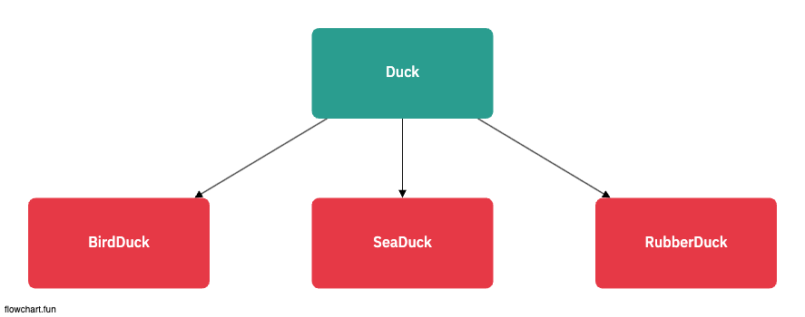
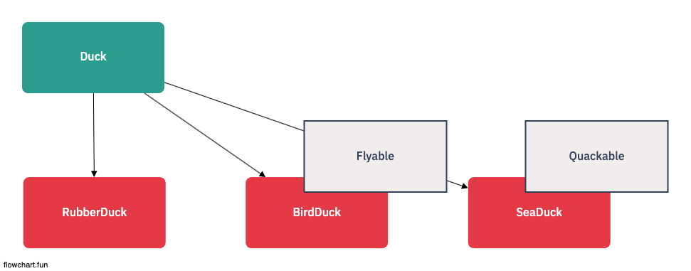
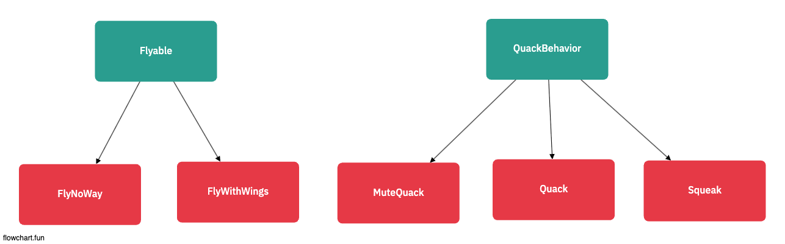

# 전략패턴

## 기존의 상속에서 문제가 될 수 있는 문제

[bad_code](./bad_code.ts)

- Duck Class 안에 Fly method가 있는 경우
  - BirdDuck, SeaDuck은 Fly를 Overriding 할 수 있지만,
  - RubberDuck은 Overriding 하지 않음 => 아무것도 하지 않도록 오버라이드 해야한다 => 과연 좋은 방법일까?

## 상속 + 인터페이스로 문제 해결하기

[good_code](./good_code.ts)

- 몇몇 필요한 메서드는 interface를 활용해서, 구현으로 진행하기
- 하지만, 코드중복은 어떻게 하지? -> interface를 활용하는 건 좋지만, 코드를 재사용하지 않기때문에 관리에 문제가 생긴다.
- 결국, 한가지 행동을 바꿀때마다 그 행동이 정의되어 있는 서로 다른 서브클래스를 전부 찾아서 코드를 일일이 찾아야 함

## 전략패턴 사용하기

[strategy.ts]

- 이미 구현된 기능을 바탕으로, 상속을 쓸때 존재하는 제외
- 재사용의 장점을 그대로 사용할 수 있다.
- Class 내부에서 Fly/NoneFly Class를 자체를 구현하여 사용한다.
